# 2D Leaves shader

install URP packages and shader graph
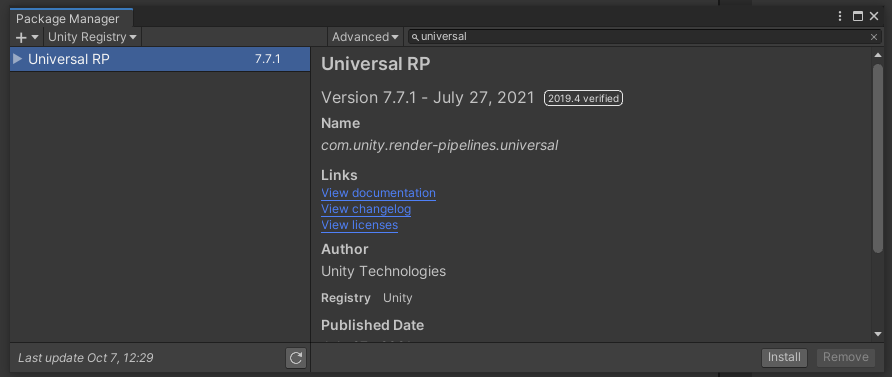  

Create pipeline asset
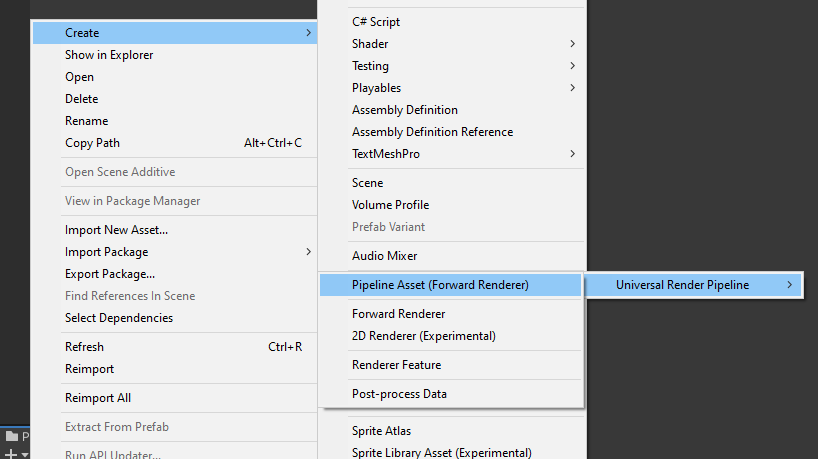  

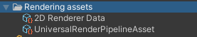  

Delete URP renderer and create 2D URP renderer
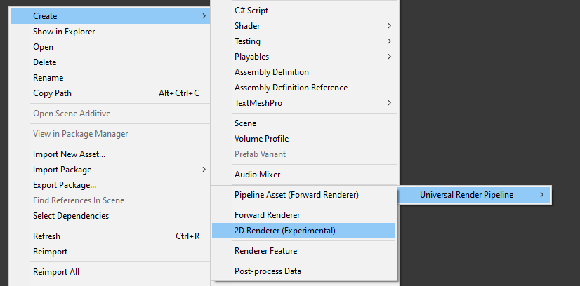  

Assign 2D URP renderer in pipeline asset
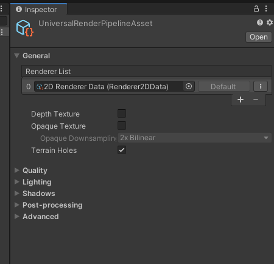  

Change project settings to use pipeline asset
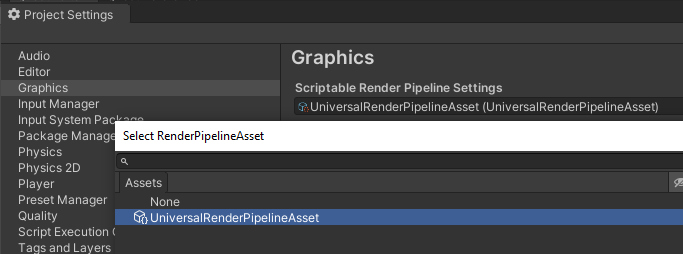  

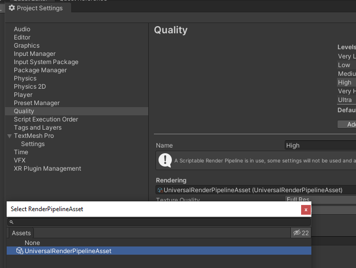  

Upgrade materials
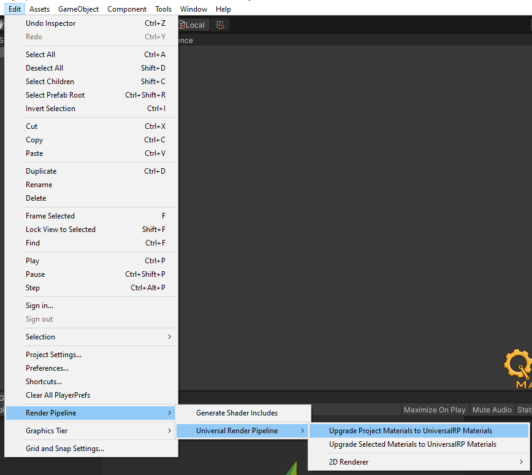  

Import leaf and change material to unlit
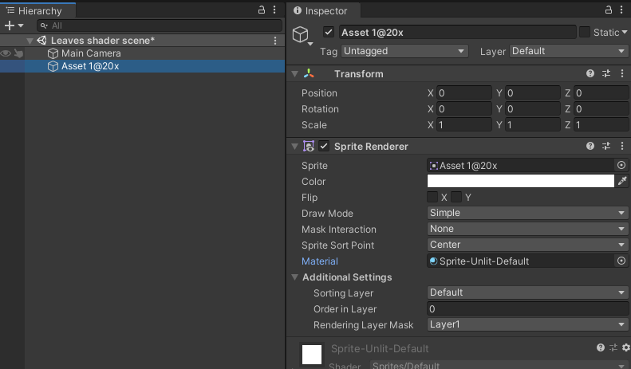  

create shader graph
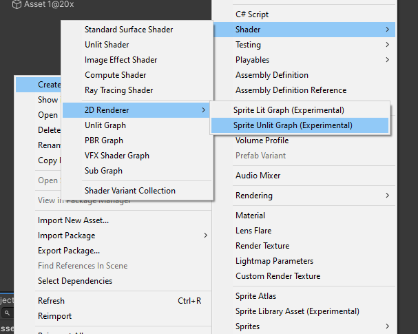  

create new material and assign Created shader
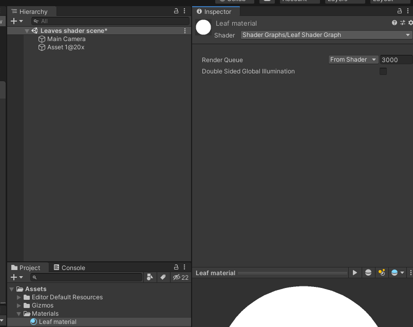  

assign the material to the sprite renderer (Weired thing would happen to sprite)
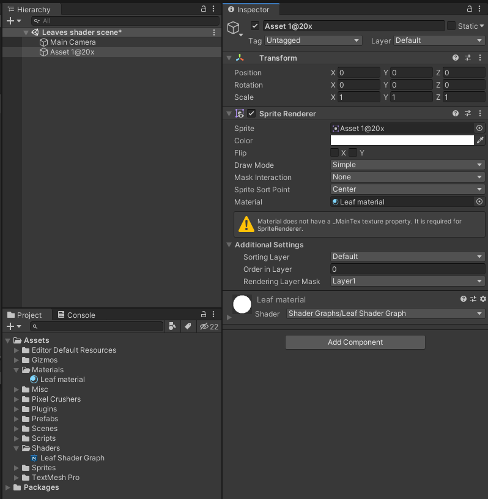  

Work progress
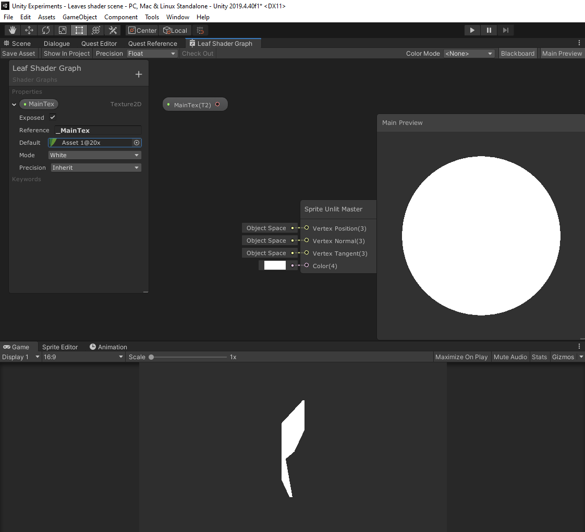  

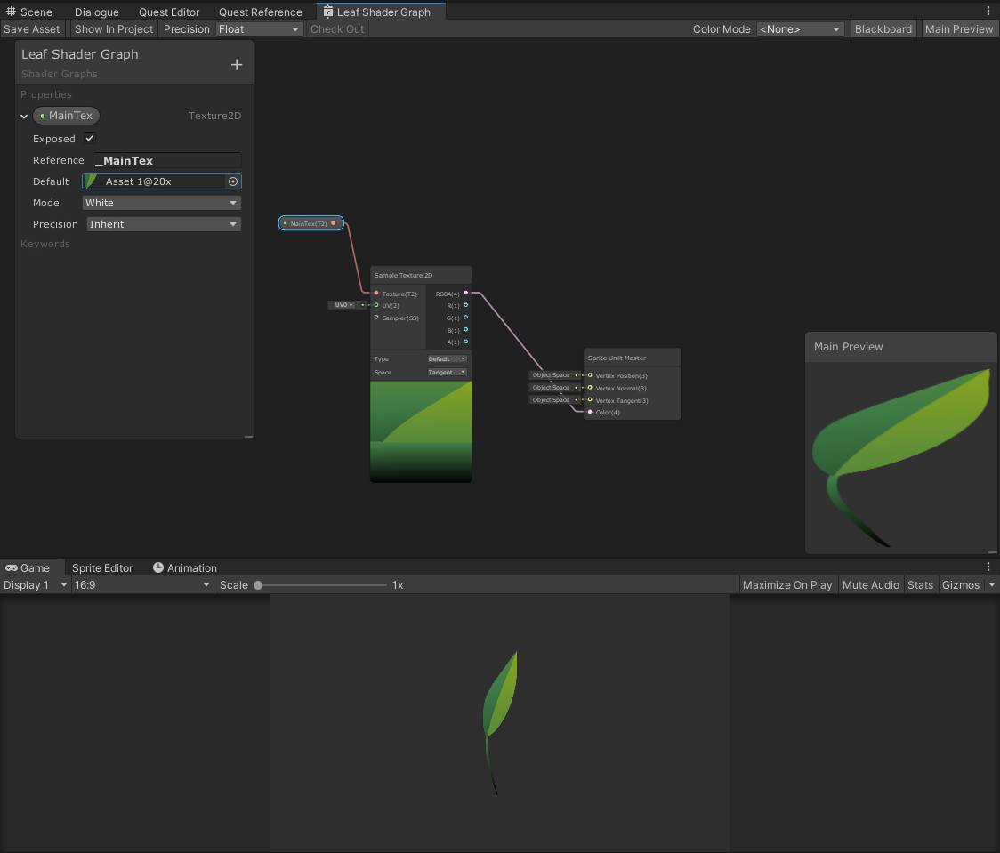  

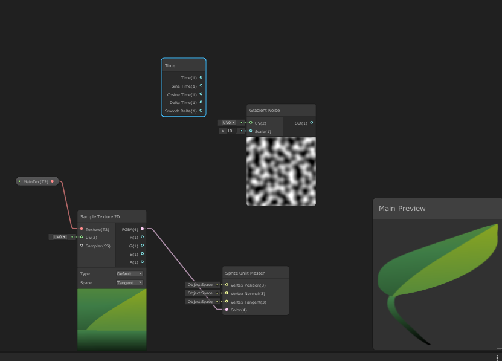  

Vector1 windspeed multiplied with Time
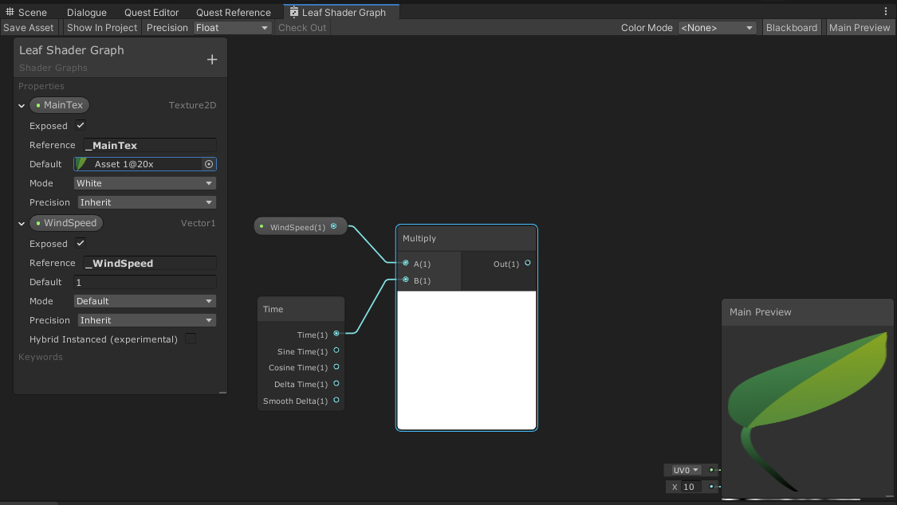  

Wind direction multiplied
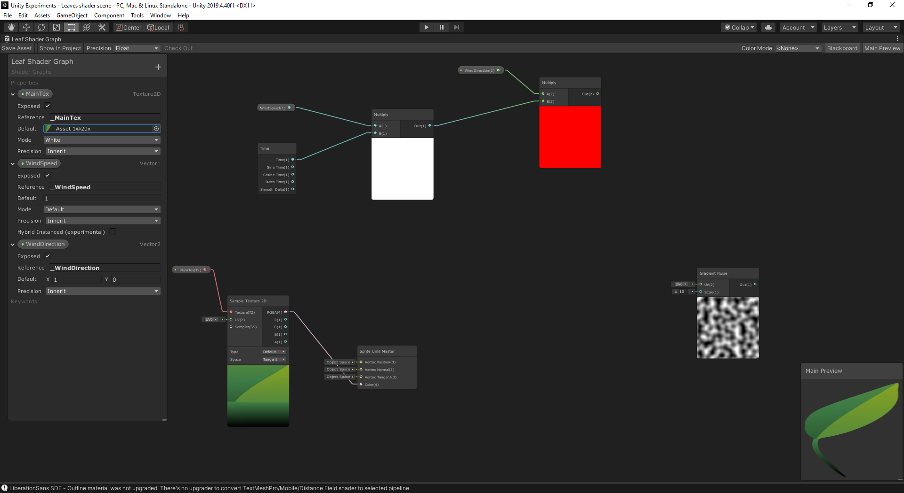  

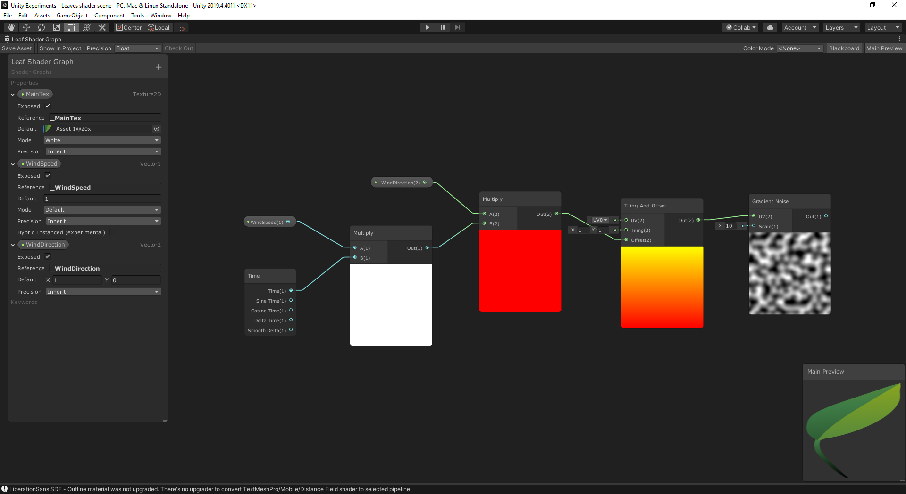  

